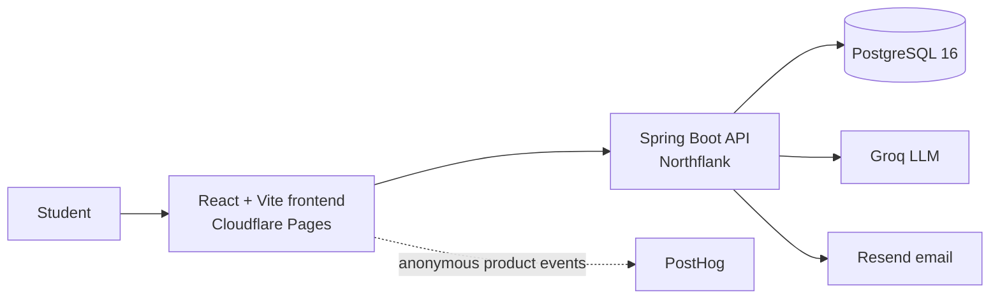

# Synapse Backend 🧠

> The production API behind [Synapse](https://studysynapse.app) — a full-stack study platform that turns uploaded notes into structured summaries, flashcards, quizzes, review schedules, and meaningful progress insights.

[](https://openjdk.org/)
[](https://spring.io/projects/spring-boot)
[](https://www.postgresql.org/)
[](https://gradle.org/)
[](https://www.docker.com/)

**[Open the live app](https://studysynapse.app)** · **[View the frontend repository](https://github.com/maegiko/synapse-frontend)** · **[Check API health](https://api.studysynapse.app/actuator/health)**


Synapse owns the complete study loop. A learner can upload a PDF, DOCX, text, or Markdown file; receive a structured AI summary; turn it into a flashcard deck or quiz; practise with spaced repetition; organise material into groups; and follow their progress over time. This repository provides the secure, transactional backend that makes that workflow possible.

## What Synapse Does ✨

### From raw notes to study material

- Extracts text from PDF, Word (`.docx`), plain text, and Markdown uploads up to 10 MB
- Produces structured summaries with an overview, key points, concepts, and important terms
- Generates editable flashcard decks and ten-question quizzes from saved notes
- Keeps generated resources linked to their source note without making that link a deletion dependency

### From study material to long-term learning

- Schedules decks with rating-based spaced repetition using `AGAIN`, `HARD`, `GOOD`, and `EASY`
- Builds a personal review queue from each deck's next review date
- Saves quiz attempts, question-count snapshots, scores, and optional study durations
- Tracks study streaks in each user's own time zone
- Aggregates 7, 30, 90, and 365-day analytics: study time, active days, retention, mastery, due forecasts, quiz performance, and improvement

### From a collection to an organised library

- Searches and paginates notes, decks, quizzes, and study groups
- Pins important content above the rest of the library
- Groups notes, decks, and quizzes without changing resource ownership
- Supports editing titles, descriptions, summaries, cards, questions, answers, and difficulty

### From registration to a secure account

- Verifies new accounts through single-use email links sent by Resend
- Uses short-lived JWT access tokens and rotating opaque refresh tokens in `HttpOnly` cookies
- Supports confirmed email changes, forgotten-password links, password changes, and refresh-session revocation
- Applies ownership constraints to every saved learning resource
- Rate-limits authentication, general API, and AI-generation traffic

## The Product Flow 🔄

1. **Upload** — the API validates and extracts text from a supported file.
2. **Understand** — Groq transforms that text into a predictable structured summary.
3. **Generate** — the saved note becomes a flashcard deck, a quiz, or both.
4. **Practise** — reviews and quiz attempts record scores, ratings, durations, and activity days.
5. **Improve** — the analytics API turns that history into trends, retention, mastery, and upcoming workload.

## Architecture 🏗️



The backend follows a feature-package architecture. Controllers define the HTTP boundary, services coordinate workflows, persistence services own database operations and DTO mapping, and Spring Data repositories keep queries focused. Flyway owns schema evolution while Hibernate validates that the Java model matches it.

## Engineering Highlights 🔍

- **Replay-resistant sessions** — refresh tokens are random opaque values stored only as SHA-256 hashes. Rotation is a single conditional database update, so concurrent reuse has one winner.
- **Purpose-separated email credentials** — verification and password-reset tokens live in different tables and are consumed by different endpoints. One type can never perform the other's action.
- **Transactional recovery** — password resets consume the link, update the BCrypt hash, and revoke every refresh token in one transaction. A failed write leaves the link usable.
- **Non-enumerating account recovery** — forgotten-password and verification-resend endpoints deliberately return the same response for known and unknown addresses.
- **Time-zone-correct learning data** — timestamps stay in UTC while streaks, review dates, and analytics windows follow the user's IANA time zone.
- **Ownership-first persistence** — public IDs are resolved together with the authenticated owner, preventing cross-account access without exposing internal database IDs.
- **Schema discipline** — 26 ordered Flyway migrations cover the platform's evolution; `ddl-auto: validate` prevents Hibernate from silently changing production data.
- **Real integration coverage** — Spring Boot integration tests run against PostgreSQL 16 through Testcontainers, while LLM and email boundaries are replaced with controlled test doubles.

## Tech Stack 🛠️

| Layer | Technology |
| --- | --- |
| Language and runtime | Java 25 |
| Application framework | Spring Boot 4.1.1, Spring MVC |
| Security | Spring Security, OAuth2 Resource Server, HS256 JWT, BCrypt |
| Persistence | PostgreSQL 16, Spring Data JPA, Hibernate, Flyway |
| AI generation | Groq as the primary `LLMClient`; Gemini implementation available as an alternate |
| Document parsing | Apache PDFBox, Apache POI, plain-text and Markdown extractors |
| Email | Resend HTTP API behind an `EmailClient` boundary |
| Rate limiting | Caffeine-backed fixed-window counters |
| API documentation | springdoc OpenAPI and Swagger UI in development |
| Testing | JUnit, MockMvc, Testcontainers |
| Build and quality | Gradle, Checkstyle, multi-stage Docker build |
| Production | Northflank backend and PostgreSQL; Cloudflare Pages frontend |

The companion frontend uses React 19, TypeScript, Vite, React Router, TanStack Query, and Tailwind CSS. Its source is available in the [Synapse frontend repository](https://github.com/maegiko/synapse-frontend).

## Run Locally 🚀

### Requirements

- Java 25
- Docker with Docker Compose
- A Groq API key for AI generation
- A Resend API key for transactional email
- A random JWT secret containing at least 32 UTF-8 bytes

### 1. Clone and configure

```bash
git clone https://github.com/maegiko/synapse-backend.git
cd synapse-backend
cp .env.example .env
```

Fill in the required values in `.env`:

```properties
JWT_SECRET=replace-with-at-least-32-bytes
GROQ_API_KEY=replace-with-your-groq-api-key
RESEND_API_KEY=replace-with-your-resend-api-key
GEMINI_API_KEY=
```

`GEMINI_API_KEY` is optional because Groq is the primary generation client. Keep `.env` local; it is intentionally excluded from version control.

### 2. Start PostgreSQL

```bash
docker compose up -d
```

The local database is created as `synapse_dev` on port `5432` with the development credentials in `docker-compose.yml`. Its data is retained in a named Docker volume.

### 3. Run the API

```bash
./gradlew bootRun
```

| Local service | URL |
| --- | --- |
| API | `http://localhost:8080` |
| Swagger UI | `http://localhost:8080/swagger-ui.html` |
| OpenAPI JSON | `http://localhost:8080/v3/api-docs` |
| Health check | `http://localhost:8080/actuator/health` |

The `dev` profile is selected by default. Swagger and the OpenAPI document are disabled under the production profile.

### 4. Run the frontend (optional)

In a sibling directory:

```bash
git clone https://github.com/maegiko/synapse-frontend.git
cd synapse-frontend
npm install
```

Set the frontend API base URL:

```properties
VITE_API_BASE_URL=http://localhost:8080
```

Then start Vite:

```bash
npm run dev
```

The development CORS configuration allows `http://localhost:5173`.

## Configuration ⚙️

Shared settings live in `src/main/resources/application.yml`, with environment-specific overrides in `application-dev.yml` and `application-prod.yml`.

### Core variables

| Variable | Required | Purpose |
| --- | --- | --- |
| `JWT_SECRET` | Yes | HS256 signing secret; must contain at least 32 bytes |
| `GROQ_API_KEY` | For generation | API key used by the primary LLM client |
| `RESEND_API_KEY` | For email | Resend key with permission to send from the verified domain |
| `GEMINI_API_KEY` | No | Key for the alternate Gemini client |
| `EMAIL_VERIFICATION_URL` | No | Frontend verification page; defaults to `http://localhost:5173/verify-email` locally |
| `PASSWORD_RESET_URL` | No | Frontend reset page; defaults to `http://localhost:5173/reset-password` locally |
| `RESEND_FROM` | No | Sender identity; defaults to `Synapse <no-reply@studysynapse.app>` |

### Production variables

| Variable | Required | Purpose |
| --- | --- | --- |
| `SPRING_PROFILES_ACTIVE=prod` | Yes | Enables production database, CORS, server, and documentation settings |
| `DB_HOST`, `DB_PORT`, `DB_NAME` | Yes | PostgreSQL connection location |
| `DB_USERNAME`, `DB_PASSWORD` | Yes | PostgreSQL credentials |
| `FRONTEND_ORIGIN` | No | Exact allowed browser origin; defaults to `https://studysynapse.app` |
| `PORT` | No | Server port supplied by the platform; defaults to `8080` |
| `JAVA_TOOL_OPTIONS` | No | JVM memory and collector settings for the container |

Important defaults:

- Access tokens: 15 minutes
- Refresh tokens: 30 days
- Registration verification links: 1 hour
- Email-change links: 24 hours
- Password-reset links: 30 minutes
- Unverified-account retention: 7 days
- Maximum upload size: 10 MB

## API Reference 📚

Most routes require an access token:

```http
Authorization: Bearer <accessToken>
```

Refresh and logout use the `refreshToken` cookie instead. Browser clients must include credentials on those requests.

### Authentication 🔐

| Method | Endpoint | Purpose | Auth |
| --- | --- | --- | --- |
| `POST` | `/api/auth/register` | Create an unverified account and send its confirmation link | Public |
| `POST` | `/api/auth/login` | Authenticate a verified account and issue a session | Public |
| `POST` | `/api/auth/refresh` | Rotate the refresh token and return a new access token | Cookie |
| `POST` | `/api/auth/logout` | Revoke the presented refresh token and clear its cookie | Cookie |
| `PUT` | `/api/auth/password` | Change a known password and revoke every refresh session | Bearer |
| `POST` | `/api/auth/email/verify` | Consume a registration or email-change verification token | Public |
| `POST` | `/api/auth/email/resend` | Request a replacement registration verification link | Public |
| `POST` | `/api/auth/password/forgot` | Request a password-reset link without revealing account existence | Public |
| `POST` | `/api/auth/password/reset` | Consume a reset token, change the password, and revoke sessions | Public |

Registration returns `202 Accepted`; the account receives a session only after its email is confirmed. Verification and reset tokens are single-use, expire automatically, and are stored only as hashes.

### User and progress 👤

| Method | Endpoint | Purpose |
| --- | --- | --- |
| `GET` | `/api/user/details` | Get the current profile, time zone, and lifetime review count |
| `PATCH` | `/api/user/details` | Update the full name and/or time zone |
| `POST` | `/api/user/email-change` | Send a confirmation link to a proposed new address |
| `GET` | `/api/user/streak` | Get current and longest streaks plus the last activity date |
| `GET` | `/api/user/analytics?period=30` | Get study analytics for 7, 30, 90, or 365 days |

### Notes 📝

| Method | Endpoint | Purpose |
| --- | --- | --- |
| `POST` | `/api/notes/summarise` | Upload, extract, summarise, and persist a note |
| `GET` | `/api/notes/list` | Search and page through saved notes |
| `GET` | `/api/notes/{noteId}` | Get a structured note summary |
| `PATCH` | `/api/notes/{noteId}` | Update its title, overview, and/or pin state |
| `DELETE` | `/api/notes/{noteId}` | Delete a note while preserving derived decks and quizzes |

`POST /api/notes/summarise` accepts multipart form data with a `file` field. The saved response contains the note's public ID, overview, key points, concepts, important terms, timestamps, group membership, and pin state.

### Flashcards 🃏

| Method | Endpoint | Purpose |
| --- | --- | --- |
| `POST` | `/api/flashcards/generate` | Generate and save a deck from a note |
| `GET` | `/api/flashcards/list` | Search and page through saved decks |
| `GET` | `/api/flashcards/{deckId}` | Get a deck and its cards |
| `PATCH` | `/api/flashcards/{deckId}` | Update the deck title and/or pin state |
| `DELETE` | `/api/flashcards/{deckId}` | Delete a deck and its cards |
| `POST` | `/api/flashcards/{deckId}` | Add a card manually |
| `PATCH` | `/api/flashcards/{deckId}/cards/{cardId}` | Update a card's front and/or back |
| `DELETE` | `/api/flashcards/{deckId}/cards/{cardId}` | Delete a card |
| `GET` | `/api/flashcards/review` | Get the current user's due review queue |
| `POST` | `/api/flashcards/{deckId}/review` | Save a rating and duration, then reschedule the deck |

The review endpoint accepts `AGAIN`, `HARD`, `GOOD`, or `EASY`. Scheduling is calculated on the server from the deck's previous interval and ease factor, then anchored to the owner's current local date.

### Quizzes ❓

| Method | Endpoint | Purpose |
| --- | --- | --- |
| `POST` | `/api/quiz/generate` | Generate and save a quiz from a note |
| `GET` | `/api/quiz/list` | Search and page through saved quizzes |
| `GET` | `/api/quiz/{quizId}` | Get a quiz with questions and answers |
| `PATCH` | `/api/quiz/{quizId}` | Update its title, description, and/or pin state |
| `DELETE` | `/api/quiz/{quizId}` | Delete a quiz, its questions, answers, and score history |
| `POST` | `/api/quiz/{quizId}/questions` | Add a question and answer set manually |
| `PATCH` | `/api/quiz/{quizId}/questions/{questionId}` | Update a question and/or replace its answers atomically |
| `DELETE` | `/api/quiz/{quizId}/questions/{questionId}` | Delete a question and its answers |
| `PUT` | `/api/quiz/{quizId}/difficulty` | Set difficulty from 1 to 5 |
| `POST` | `/api/quiz/{quizId}/score` | Save a score and optional attempt duration |
| `GET` | `/api/quiz/{quizId}/score/list` | Get score history from newest to oldest |

Each score stores the quiz's question count at submission time, so historical percentages remain meaningful after a quiz is edited.

### Study groups 🗂️

| Method | Endpoint | Purpose |
| --- | --- | --- |
| `POST` | `/api/groups` | Create an empty group |
| `GET` | `/api/groups/list` | Search and page through groups with content counts |
| `GET` | `/api/groups/{groupId}` | Get a group with its notes, decks, and quizzes |
| `PATCH` | `/api/groups/{groupId}` | Update the name and/or description |
| `DELETE` | `/api/groups/{groupId}` | Delete the group without deleting its content |
| `PUT` | `/api/groups/{groupId}/notes/{noteId}` | Add or move a note into the group |
| `DELETE` | `/api/groups/{groupId}/notes/{noteId}` | Remove a note from the group |
| `PUT` | `/api/groups/{groupId}/decks/{deckId}` | Add or move a deck into the group |
| `DELETE` | `/api/groups/{groupId}/decks/{deckId}` | Remove a deck from the group |
| `PUT` | `/api/groups/{groupId}/quizzes/{quizId}` | Add or move a quiz into the group |
| `DELETE` | `/api/groups/{groupId}/quizzes/{quizId}` | Remove a quiz from the group |

Deleting a group ungroups its content rather than deleting it. Every membership operation verifies that the group and resource have the same authenticated owner.

### System ❤️‍🩹

| Method | Endpoint | Purpose | Availability |
| --- | --- | --- | --- |
| `GET` | `/actuator/health` | Minimal liveness/readiness signal | All profiles |
| `GET` | `/swagger-ui.html` | Interactive API documentation | Development only |
| `GET` | `/v3/api-docs` | OpenAPI JSON | Development only |

### Shared API conventions

- List routes accept `query`, zero-based `page`, and `size` from 1 to 100.
- Resources use 10-character public IDs; internal numeric IDs are not exposed.
- Validation and domain failures share one response shape: `{ "message": "..." }`.
- A resource that is absent and one owned by somebody else both resolve as `404`.
- `429 Too Many Requests` responses include a `Retry-After` header.

## A Quick API Walkthrough 🧪

Register an account:

```bash
curl -X POST http://localhost:8080/api/auth/register \
  -H "Content-Type: application/json" \
  -d '{
    "fullName": "Ada Lovelace",
    "email": "ada@example.com",
    "password": "password123",
    "timeZone": "Australia/Sydney"
  }'
```

After confirming the emailed link, use the returned access token to summarise a note:

```bash
curl -X POST http://localhost:8080/api/notes/summarise \
  -H "Authorization: Bearer <accessToken>" \
  -F "file=@/path/to/lecture-notes.pdf"
```

Generate a quiz from its public note ID:

```bash
curl -X POST http://localhost:8080/api/quiz/generate \
  -H "Authorization: Bearer <accessToken>" \
  -H "Content-Type: application/json" \
  -d '{ "noteId": "<noteId>" }'
```

The local Swagger UI is the easiest way to explore every request and response interactively.

## Security Model 🛡️

- Access tokens are HS256 JWTs with a 15-minute lifetime.
- Refresh tokens are 32 random bytes, returned only in a secure `HttpOnly` cookie and stored only as SHA-256 hashes.
- Refresh rotation and single-use email-token consumption use conditional updates rather than read-then-write checks.
- Passwords are stored with BCrypt.
- Password changes and password resets revoke every refresh token belonging to the account.
- Verification, resend, login, registration, password-reset, authenticated API, and AI-generation routes have separate limits.
- CORS allows only configured frontend origins and supports credentialed browser requests for the refresh cookie.
- Swagger and OpenAPI are unavailable in production.

## Rate Limiting 🚦

Default limits use bounded, fixed-window counters in a Caffeine cache:

| Scope | Default limit | Key |
| --- | --- | --- |
| AI generation | 3/minute and 50/day | User ID |
| Other authenticated API calls | 120/minute | User ID |
| Login | 10/15 minutes | Normalised email and client address separately |
| Registration | 10/hour | Client address |
| Verification resend | 3/hour | Normalised email and client address separately |
| Forgotten password | 3/hour | Normalised email and client address separately |
| Email change | 3/hour | User ID |

These counters are deliberately local to one application instance. See [Scope and trade-offs](#scope-and-trade-offs) for the scaling implication.

## Testing and Quality ✅

Run the integration and unit tests:

```bash
./gradlew test
```

Run Checkstyle:

```bash
./gradlew lint
```

Run the complete verification:

```bash
./gradlew test lint
```

Docker must be running because integration tests start PostgreSQL 16 through Testcontainers. LLM-backed flows mock the `LLMClient`, and the shared integration-test configuration replaces email delivery, so the suite neither spends provider tokens nor sends real messages.

Coverage includes authentication and rotation races, verification and reset-token concurrency, transactional rollback, account enumeration resistance, resource ownership, document extraction, generation flows, editing, groups, spaced repetition, time-zone boundaries, analytics, score history, streaks, and rate limiting.

## Database and Migrations 🗄️

Flyway migrations live in `src/main/resources/db/migration` and run automatically at startup. They cover:

- Accounts, hashed session tokens, verification, and password reset
- Structured notes and extracted summary sections
- Flashcard decks, cards, scheduling state, and review history
- Quizzes, questions, answers, score snapshots, and durations
- Study groups, pinning, streak activity, time zones, and UTC normalisation

Hibernate uses `ddl-auto: validate`; it verifies the mapping but never owns schema evolution.

## Deployment 🚢

The repository includes a multi-stage Docker build. It compiles the application on a Java 25 JDK, copies only the boot jar into a Java 25 JRE image, and runs as a non-root user.

```bash
docker build -t synapse-backend .
```

For production:

1. Provision persistent PostgreSQL storage.
2. Configure the production variables listed above.
3. Set `SPRING_PROFILES_ACTIVE=prod`.
4. Deploy the image and use `/actuator/health` as the health check.
5. Let Flyway migrate the database before serving traffic.

The production profile caps HikariCP at five connections, honours forwarded headers, enables graceful shutdown, and exposes only the health actuator endpoint.

## Project Structure 🧱

```text
src/main/java/com/synapse/backend
├── ai           # Provider clients, prompts, and the LLM boundary
├── analytics    # Study-history aggregation and analytics DTOs
├── auth         # Sessions, email verification, and password recovery
├── config       # Clock, scheduling, REST client, and MVC configuration
├── docs         # Development OpenAPI configuration
├── email        # Resend integration behind EmailClient
├── flashcards   # Deck generation, editing, review scheduling, and history
├── groups       # Study-group CRUD and content membership
├── notes        # File extraction, AI summaries, editing, and persistence
├── quiz         # Generation, editing, play results, and score history
├── security     # CORS, JWT encoding/decoding, and route security
├── shared       # Errors, file extractors, and rate limiting
├── streak       # Daily qualifying activity and streak calculations
└── user         # Profiles, time zones, and confirmed email changes
```

## Scope and Trade-offs 🧭

- Note ingestion supports PDF, DOCX, TXT, and Markdown. Scanned images and legacy `.doc` files require an OCR/conversion step outside Synapse.
- LLM output quality and availability depend on the configured provider; malformed or unavailable provider responses are surfaced as `502 Bad Gateway`.
- Rate limits are in-memory and best suited to the current single-instance deployment. Horizontal scaling would require a shared counter store such as Redis.
- Access tokens are intentionally short-lived rather than server-blacklisted, so a token issued before a password reset can remain valid for the balance of its 15-minute lifetime.

---

Synapse was built end to end: database design, secure authentication, document parsing, AI orchestration, learning algorithms, analytics, responsive frontend, transactional email, automated tests, and production deployment.
